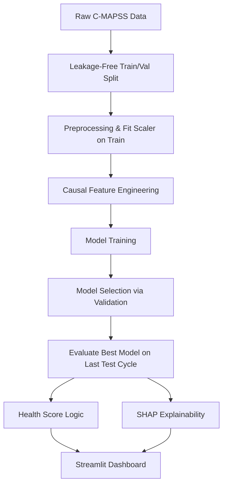

# AeroTwin — Explainable Aircraft Engine Health & Remaining Useful Life Prediction ✈️

A complete, end-to-end Machine Learning pipeline for predicting the Remaining Useful Life (RUL) of turbofan aircraft engines based on sensor telemetry.

This project is built to demonstrate practical, defensible data science and engineering skills in the context of **aerospace predictive maintenance**.

## Problem & Context

**Predictive Maintenance** aims to predict when equipment failure might occur, preventing unexpected downtime while avoiding unnecessary early maintenance. 

In aerospace, **Engine Health Monitoring** uses sensor telemetry (temperatures, pressures, speeds) to estimate an engine's **Remaining Useful Life (RUL)**. RUL represents the number of operational cycles an engine can safely perform before requiring maintenance or overhaul.

## Why This Matters

Unplanned engine failures or overly conservative maintenance schedules cost airlines millions of dollars annually. By applying Machine Learning to sensor telemetry, we can:
- Maximize the operational lifespan of engine components.
- Transition from *reactive* to *proactive* maintenance.
- Provide explainable insights into which sensors indicate degradation.

*(Note: This project is inspired by publicly documented industry use cases of predictive maintenance and digital twins. It does not use proprietary data or models.)*

## Dataset

This project uses the **NASA C-MAPSS (Commercial Modular Aero-Propulsion System Simulation) Turbofan Engine Degradation Simulation Dataset**.

**Reference:** 
A. Saxena, K. Goebel, D. Simon, and N. Eklund, "Damage Propagation Modeling for Aircraft Engine Run-to-Failure Simulation", in the Proceedings of the 1st International Conference on Prognostics and Health Management (PHM08), Denver CO, Oct 2008.

**Source:** NASA Open Data Portal / Prognostics Center of Excellence.

- **Dataset Subset:** FD001
- **Engines:** 100 Train / 100 Test
- **Conditions:** Sea Level
- **Fault Mode:** HPC Degradation

## Methodology

The pipeline follows a robust, leakage-free data science process:

1. **Train/Validation Split:** Strict splitting by Engine ID (80/20) applied *before* any scaling or leakage-prone preprocessing.
2. **Data Preprocessing:** Removal of constant/uninformative sensors. MinMax scaling fitted strictly on the training set and applied to validation and test sets. RUL capped at 125 cycles for training targets to focus on the meaningful degradation region.
3. **Feature Engineering:** Creation of causally strict temporal degradation indicators including Rolling Means, Rolling Standard Deviations, Rolling Slopes (Trend), and EWMA. Excluded all look-ahead features (e.g. `cycle_norm`) to prevent failure-time leakage.
4. **Model Selection:** Evaluation of Naive Baselines, Linear Regression, Random Forest, and XGBoost on the validation set.
5. **Final Evaluation:** Following strict NASA C-MAPSS protocol, the selected model is evaluated **only on the final cycle** of each untouched test trajectory against the uncapped true RUL.
6. **Explainability (SHAP):** Extraction of global and local feature importance to answer *why* the model predicted a specific RUL.
7. **Health Intelligence:** Translation of RUL into an interpretable 0-100 Health Score and Risk Category.

## Architecture



## Model Results

Final evaluation on the untouched Test set (Last Cycle Evaluation protocol):

| Model             | Test MAE (Cycles) | Test RMSE (Cycles) |
| ----------------- | ----------------: | -----------------: |
| Baseline          |             35.90 |              43.10 |
| Linear Regression |             14.71 |              18.68 |
| Random Forest     |             12.52 |              17.27 |
| **XGBoost**       |         **12.31** |          **17.44** |

*(Note: Metrics reflect actual pipeline execution results based on strict C-MAPSS evaluation protocol).*

## Explainability

Using SHAP (SHapley Additive exPlanations), we identified the most influential sensors driving the model's predictions. The model primarily relies on:
- **Cycle** (Current operational cycle of the engine)
- **Sensor 11 (Static pressure at HPC outlet) - Rolling Mean**
- **Sensor 4 (Total temperature at LPT outlet) - Rolling Mean and EWMA**
- **Sensor 15 (Bypass ratio) - Rolling Mean**

These sensors show strong trends as the High Pressure Compressor (HPC) degrades. Note that SHAP values indicate model contribution, not physical component causation.

## Dashboard

The project includes an interactive Streamlit dashboard (`app/streamlit_app.py`) providing:
- Engine selection and overview metrics
- RUL degradation trajectory plots
- Individual sensor health and trend analysis
- Maintenance insights and SHAP explainability

## Limitations

- The C-MAPSS dataset is simulated, not real airline fleet telemetry. Real data would contain more noise, missing values, and varying operational conditions.
- Predictions and Health Scores are portfolio/research outputs, not certified maintenance decisions.
- High SHAP values indicate model reliance, but do not definitively prove physical component causality.

## Future Work

- Implementation of LSTM/GRU networks for deep sequence modeling.
- Probabilistic RUL prediction (predicting a distribution rather than a point estimate).
- Expansion to complex multi-condition datasets (FD002/FD004).

## Getting Started

### Installation

```bash
git clone https://github.com/yourusername/aerotwin.git
cd aerotwin
pip install -r requirements.txt
```

### Run the Pipeline

```bash
python run_pipeline.py
```

### Run the Dashboard

```bash
streamlit run app/streamlit_app.py
```

### Run Tests

```bash
pytest tests/
```
